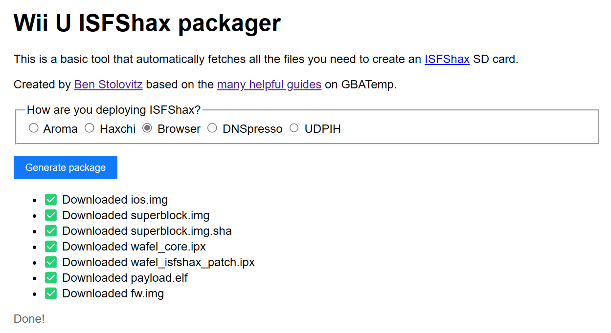

# ISFSHAX packager

Simple online tool to give you 1 ZIP file that you can use to install ISFSHAX!

Publishing as an example.



## Usage

Run locally:

```bash
npm install # once, then

npm run dev
```

> [!NOTE]
> Since GitHub releases don't enable CORS, you must use a CORS proxy. The one I'm using allows open source, but it takes work.
>
> It's probably easiest to rebundle everything in the backend?

### Future work/ideas

* [ ] Download known-good versions
* [ ] Checksum validation
* [ ] Avoid CORS
* [ ] Support generic Aroma installation, since that's the most common case & requires a few downloads.
* [ ] Support redNAND setup, since that require lots of downloads.

## Testing

Tested works when plopped onto a working (otherwise standard) Aroma SD card plus fw_img_loader payload. I'm pretty certain it'll work for the other scenarios, too.
